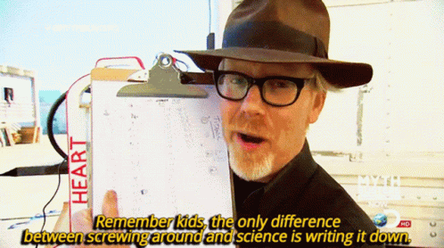

```{r setup, include=FALSE}
options(htmltools.dir.version = FALSE)
knitr::opts_chunk$set(echo = TRUE)
```

```{r echo=F, message=F, warning = F}
require(xaringanExtra) 
require(stargazer)
require(tidyverse)
require(knitr)
```

```{r xaringan-logo, echo=FALSE}
xaringanExtra::use_logo("NU2.png")
```

```{r xaringan-tile-view, echo=FALSE}
xaringanExtra::use_tile_view()
```

## Outline

* Who am I?
* UKRN
* What are Open Research Practices?
* How can we help? What do I need from you


```{r, out.width = "600px", echo=FALSE, fig.align='center'}
knitr::include_graphics("https://media.giphy.com/media/3o7aTskHEUdgCQAXde/giphy.gif") 
```

---
## Who am I?

* [Thomas Pollet](http://tvpollet.github.io/) - Professor in Dept of Psychology.

--

* Institution Lead (IL) for the UK Reproducibility Network ([www.ukrn.org](www.ukrn.org))

--

* IL: 'Top Down': 'Senior management'; I meet with and develop policy with UKRN, promote UKRN, liaise with PVC on UKRN goals, and deliver training - I am independent from Local Network Lead (and technically this role is also independent from the University)

--

* Local Network Lead: 'Bottom up': [David Smailes](https://www.northumbria.ac.uk/about-us/our-staff/s/david-smailes/) (Asst. Prof. in Psychology)

```{r, out.width = "200px", echo=FALSE, fig.align='center'}
 
```

---
## Local Network Lead

David does ‘grassroots’ open research 'stuff'. Tries to stimulate 'open research practices'.

--

For example, [ReproducibiliTea](https://reproducibilitea.org/).

```{r, out.width = "300px", echo=FALSE, fig.align='center'}
knitr::include_graphics("Teapot.jpg") 
```

---
## UKRN: Goals

"The [UK Reproducibility Network (UKRN)](www.ukrn.org) is a **national peer-led consortium** that aims to ensure the UK retains its place as a centre for world-leading research. We do this by investigating the factors that contribute to robust research, promoting training activities, and disseminating best practice. We also work collaboratively with various **external stakeholders** to ensure coordination of efforts across the sector.

We seek to understand the factors that contribute to poor research reproducibility and replicability, and develop approaches to counter these, in order to improve the trustworthiness and quality of research. These issues affect all disciplines, so we aim for broad disciplinary representation. We believe that ongoing efforts to address these issues represent an opportunity to improve our research by **reforming culture and practice.**"

--> keywords: Multidiscipline; Meta-Research; Training support; Distributed network

---
## UKRN: structure.

* [Steering group](https://www.ukrn.org/steering-group/) chaired by Marcus Munafò

* [Advisory group](https://www.ukrn.org/advisory-board/)

* [Local and institutional memberships](https://www.ukrn.org/institutional-leads/)

---
## What are Open Research Practices?

* An umbrella term for many practices. Often linked with other domains of 'good' research practices: Research Integrity, Research ethics, Digitisation, Research culture.

--

* Tend to have aims of making our work more:
    - **Accessible.** e.g., articles/books open access. Allowing others to re-use your research.
    - **Reproducible.** Being more transparent about your research process. Using tools/resources that are open access, which allow others to reproduce your findings.
    - **Replicable (?).** Increasing likelihood of someone finding the same effect.

--

```{r, out.width = "300px", echo=FALSE, fig.align='center'}
 
```

---
## Why are these practices useful to us?

* Cynically: In everybody's self-interest everybody should engage with these.

* Open Research is the Future: More journals, funders, universities etc. will have requirements.

* Developing these practices and having a track record --> **Smart Move.**

```{r, out.width = "300px", echo=FALSE, fig.align='center'}
knitr::include_graphics("Cynic.gif") 
```

---
## Less cynically ... .

* Engaging in these practices --> ‘The Right Thing To Do’.

--

* Adopting open research practices means developing a more robust evidence base for our research.

--

* Sharing our knowledge more effectively.

---
## What I/we need from you.

* Identifying people with an interest in Open Research. UKRN will launch: "Train the trainer programme".

* Promotion of UKRN event on **March 29th**.

* Input (/feedback) on Open Research policy. Engagement with Research Culture survey.

```{r, out.width = "300px", echo=FALSE, fig.align='center'}
knitr::include_graphics("https://media.giphy.com/media/l4lRhrxMyrKUR0n9C/giphy-downsized-large.gif")
```


---
## How can we help?

* Get in touch.

* If you or your staff need guidance on any 'Open Research stuff', send David or me an [email](mailto:thomas.pollet@northumbria.ac.uk).

For broader policy: Probably me.

For Early Career Researchers (ECRs): Probably David -- [david.smailes@northumbria.ac.uk](mailto:david.smailes@northumbria.ac.uk) !

We will do our best to help but some queries we might pass on.

We might lean on the [UKRN’s](www.ukrn.org) resources/network as well.

Some dedicated resources at the library (e.g., regarding open access, preprinting, etc.)

```{r, out.width = "150px", echo=FALSE, fig.align='center'}
knitr::include_graphics("https://media.giphy.com/media/muIPu46O6z5d6jVZaL/giphy-downsized-large.gif")
```

---
## Any Questions?

[http://tvpollet.github.io](http://tvpollet.github.io)

These slides: [https://tvpollet.github.io/faculty_ukrn_talk/Lecture_open_science_faculty.html](https://tvpollet.github.io/faculty_ukrn_talk/Lecture_open_science_faculty.html#1)

```{r, out.width = "600px", echo=FALSE, fig.align='center'}
knitr::include_graphics("https://media.giphy.com/media/3ohzdRoOp1FUYbtGDu/giphy.gif")
```

---
## Acknowledgments

* I am indebted to David Smailes who provided me with a slide deck on which sections are based.

* The slides were created in [RMarkdown](https://rmarkdown.rstudio.com/) with the [xaringan](https://github.com/yihui/xaringan) package.

* You for listening!

```{r, out.width = "500px", echo=FALSE, fig.align='center'}
knitr::include_graphics("https://media.giphy.com/media/10avZ0rqdGFyfu/giphy.gif")
```

---
## Some resources

* [www.ukrn.org](www.ukrn.org)
* [RepoducibiliTea](https://reproducibilitea.org/)
* [Center for Open Science](https://www.cos.io/?hsLang=en)
* [UKRI](https://www.ukri.org/about-us/policies-standards-and-data/good-research-resource-hub/open-research/)
* [Registered Reports](https://www.cos.io/initiatives/registered-reports)
